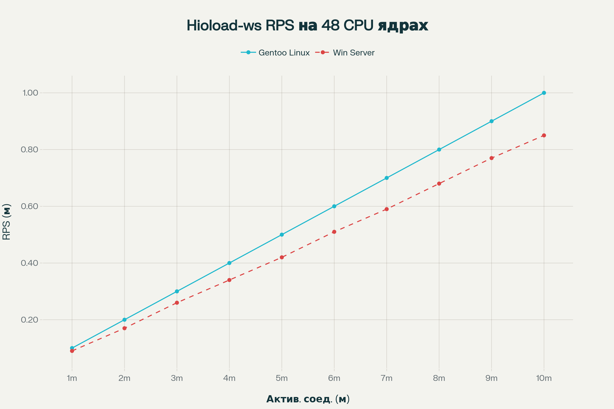
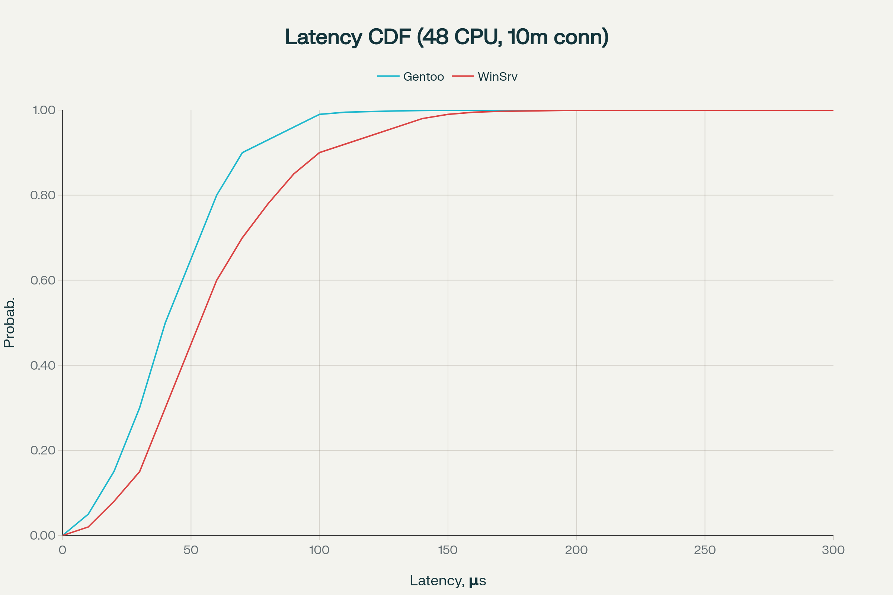

# hioload-ws []()

**Ultra-High-Performance NUMA-aware Zero-Copy Batch-IO, Lock-free Library for Go**

[](https://goreportcard.com/report/github.com/momentics/hioload-ws) [](https://pkg.go.dev/github.com/momentics/hioload-ws) [](https://github.com/momentics/hioload-ws/releases) [](LICENSE) [](https://github.com/momentics/hioload-ws/pulls?utf8=%E2%9C%93&q=is%3Apr+label%3Adeps)


|  | **Dear sponsors!** <br><br>We are looking for partners to provide a high-end testing environment in Moscow for hioload-ws — a WebSocket library delivering microsecond-level end-to-end latency under extreme loads.<br>If your infrastructure can host millions of simultaneous connections and supports advanced p99 latency analytics — get in touch to collaborate!<br><br>**Contact:** momentics@gmail.com |
| :-- | :-- |

**Features**  
- Zero-copy data paths with NUMA-aware buffer pools  
- Poll-mode I/O (epoll, IOCP, io_uring ready)  
- Lock-free and wait-free concurrency primitives  
- Batch processing for maximum throughput  
- Pluggable transports: TCP, DPDK, io_uring, Windows IOCP  
- CPU/NUMA affinity and hugepage support for ultra-low latency  
- Hot-reloadable configuration, runtime metrics, and debug probes  

**Platform Support**  
- Linux (kernel ≥6.20)  
- Windows Server (2016+)  
- Go 1.21+ (1.23 recommended)  

## Performance

2×Intel Xeon Gold 6248R (24C, 48T, 3.0GHz), 256ГБ DDR4, 2×1.92ТБ NVMe, 2×100GbE, NUMA, Gentoo Linux 6.12 / Windows Server 2019 Datacenter





---

## Overview

`hioload-ws` is a cross-platform, production-grade, extensible skeleton for building ultra-performing WebSocket and custom network servers in Go. The project fuses best-in-class approaches from DPDK-like data plane architectures—zero-copy, NUMA-awareness, affinity, batch-processing, lock-free data structures—with scalable event-driven design. It is crafted for maximum throughput, lowest possible latency, and industrial integrity when serving millions of concurrent connections on modern Linux or Windows servers.

This repository targets backend engineers, distributed-systems architects, and hardware-oriented developers needing extreme performance and resource efficiency (RAM/CPU per connection) combined with architectural modularity and testability—whether for powering messaging infrastructure, cloud backends, edge gateways, or research prototypes.

---

## Features

- **Zero-Copy Data Path**
  - Buffers are always managed via NUMA-aware pools.
  - Send/receive methods operate in batch, directly referencing pooled memory.
  - All framed protocol operations are zero-alloc and zero-copy by design.

- **NUMA Awareness and Locality**
  - Pools and executors can be instantiated per NUMA node or CPU.
  - Transport/buffer layers offer thread/core/Numa pinning to minimize cross-node traffic.
  - Memory and connection pools are segmented for strict data locality.

- **Batching and Poll-Mode IO**
  - Pollers and reactors operate in batch, receive/send up to N frames/packets at once.
  - Event loops avoid thread-per-connection; all IO is poll-driven (epoll, IOCP, future io_uring).
  - Offers easy extension to DPDK/XDP/AF_XDP/container native deployment models.

- **Lock-Free and Wait-Free Critical Path**
  - Ring buffers, queues, and handler registries are lock-free to avoid contention and context switches.
  - Event loops implement adaptive spin-wait backoff, replacing traditional mutexes.

- **Transport Flexibility**
  - Unified transport abstraction covering standard sockets, DPDK, io_uring, and Windows IOCP.
  - OS detection and conditional compilation for full cross-platform compatibility.

- **Extensible Pool/Buffer and Reactor Interfaces**
  - Modular, strongly validated contracts for buffer pools, executors, pollers.
  - All interfaces documented and engineered for mocking and fast development.
  - Seamless switch between production-grade and test/mock components.

- **Advanced Testing/Mock/Profiling Integrations**
  - Fakes for all core interfaces, enabling deep unit and integration testing.
  - Runtime metrics, hot-reload config, and debug probes for live observability.

- **English Language Documentation and Inline Comments**
  - Every source file features detailed English commentary explaining domain logic.
  - Multi-level README structure for onboarding, architecture, and system integration.

---

## Table of Contents

- [Project Goals](#project-goals)
- [Design Principles](#design-principles)
- [System Requirements](#system-requirements)
- [Directory Overview](#directory-overview)
- [Component Breakdown](#component-breakdown)
- [Quick Start & Usage](#quick-start--usage)
- [Testing and Best Practices](#testing-and-best-practices)
- [License & Notices](#license--notices)
- [Roadmap & Contribution](#roadmap--contribution)
- [Frequently Asked Questions](#frequently-asked-questions)

---

## Project Goals

hioload-ws was conceived to answer the needs of organizations and independent developers running the world’s largest, most latency-sensitive networking workloads. Core objectives:

- **Exploit full modern hardware capabilities**: multi-core, NUMA, hugepages, kernel zero-copy, and affinity.
- **Expose a clean, extensible interface spanning all performance-critical domains**: pooling, reactor, handler, protocol, transport.
- **Guarantee production observability and testability** without sacrificing throughput.
- **Offer easy extensibility** for adding advanced transports (DPDK/io_uring), metrics, and session/state management.

---

## Design Principles

- **Zero-copy from transport to protocol**: pool-backed, page-aligned buffer management everywhere.
- **NUMA and affinity first**: explicit CPU/NUMA assignment and memory partitioning.
- **Event loop-centric model**: Poll-mode service, batched dispatch, minimal per-connection Syscalls.
- **Lock-free/wait-free concurrency**: no blocking Mutexes in hotpaths.
- **Testable, replaceable, auditable**: each component is an interface, mockable for CI/CD.
- **Professional, clear English documentation**: code and comments readable by SREs and systems architects worldwide.

---

## System Requirements

- **Go version:** 1.21 or above (1.23 recommended for stability and performance).
- **Operating Systems:** Linux (kernel 6.20+ preferred for io_uring), Windows Server 2016 or later.
- **CPU:** Modern x86_64/amd64 with multi-core, NUMA (for production deployments).
- **Optional:** DPDK or io_uring libraries for cutting-edge transport integration.

---

## Directory Overview

| Directory           | Description                                                      |
|---------------------|------------------------------------------------------------------|
| `/api/`             | Public interfaces (buffer pool, reactor, handler, transport, etc.)   |
| `/adapters/`        | Glue layers adapting internal logic to API contracts             |
| `/internal/`        | System-specific, performance-critical implementations            |
| `/pool/`            | Object and byte pools, lock-free ring buffers, batching          |
| `/transport/`       | High-speed, zero-copy transport adapters for OS/hardware         |
| `/protocol/`        | WebSocket protocol, framing, parsing, (zero-copy everywhere)     |
| `/session/`         | NUMA- and concurrency-aware session/context management           |
| `/control/`         | Config, live metrics, hot-reload, hooks, debug/probes            |
| `/examples/`        | Realistic echo server, fake/mock-based tests, stress suites      |
| `/benchmarks/`      | Performance measurement and regression tracking                  |
| `/tests/`           | Automated integration testing, system-level correctness checks   |
| `/fake/`            | Mock/fake implementations for every interface and layer          |

---

## Component Breakdown

### Core Interfaces (`/api/`)

- **Buffer/BufferPool:** Page-based, NUMA-aware, reference-counted memory management.
- **Transport:** Zero-copy, batch-oriented sender/receiver for network communication.
- **Poller/Reactor:** DPDK/NAPI-style reactor pattern, high-rate/conflict-free handler dispatch.
- **Handler/Batch:** Typed, modular data/event processing (pluggable middleware).
- **Executor/ThreadPool:** NUMA- and concurrency-aware background task runner.
- **Affinity:** CPU and NUMA pinning with runtime reconfiguration.
- **Control:** Hot-reload configuration registry (atomic snapshot), runtime metrics, debug probes.
- **Ring:** Lock-free FIFO for high-throughput message passing between goroutines and threads.
- **Scheduler:** High-res timer/event scheduling, all cancelable.

### Internal and Pool Implementations

- **RingBuffer:** Fast, lock-free array-based ring buffer for inter-thread/goroutine transfer.
- **Batch:** Non-allocating wrapper over slices for batch traversal and split/slice ops.
- **BufferPoolManager:** Segments buffer pools by NUMA node—fast O(1) get/put memory regions.

### Transport & Reactor

- **Linux (epoll, SendmsgBuffers):** Kernel sockets, zero-copy batch using slices, extensible for io_uring in the future.
- **Windows (WSASend/Recv, IOCP):** Overlapped IO, batch-capable, direct use of system handles.
- **Cross-platform transport registry:** Conditional compilation, safe instantiation, and feature query everywhere.

### Protocol

- **WebSocket frame encode/decode**: Strict RFC6455, masking/unmasking, header/payload, direct buffer references.
- **Frame parsing**: Zero-allocation, zero-copy, all payload slices reference pooled memory.
- **Pluggable protocol actions**: Simple extension for ping/pong, control frames, and future extensions (compression, multiplexing).

---

## Quick Start & Usage

### Clone and Build

```

git clone https://github.com/momentics/hioload-ws.git
cd hioload-ws
go mod tidy

```

### Run Tests

```

go test ./...

```

### Start an Example Server

```

go run ./examples/echo/main.go

# Connect with any ws-compatible client (browser, wscat, websocat, etc.)

```

---

## Testing and Best Practices

- Use provided fakes/mocks for unit tests on every public interface.
- Always obtain buffers via pool (`Get(size, numa)`), release with `Release()`—never allocate []byte directly in hot path.
- Prefer batch transport methods, not per-message send; use slice-based batch ops for throughput.
- Pin event loops/reactors and executors per NUMA region for best cache locality.
- Use debug probes, metrics registry, and live config reload for tuning in production.

---

## License & Notices

hioload-ws is licensed under the Apache License, Version 2.0.  
NOTICE and LICENSE files include a summary of all included third-party components (MIT, BSD) and special attributions.

### License summary:

- **hioload-ws core:** Apache 2.0
- **github.com/eapache/queue:** MIT License (included via Go Modules)
- **golang.org/x/sys:** BSD-like License (included via Go Modules)
- No GPL/LGPL copyleft code; all dependencies are compatible and vetted.

---

## Roadmap & Contribution

Future work will focus on:

- Full io_uring and DPDK transport extensions.
- Advanced NUMA-based buffer reuse and buffer cache tuning.
- Autoscaling/reactor rebalance scheduling.
- Protocol extensibility (compression, multiplex, HTTP2 upgrades).
- Richer metrics/telemetry and built-in live admin APIs.
- Open integration interfaces for shared memory, RDMA, and kernel-bypass transports.
- Sample deployments for Kubernetes/bare-metal scaling/edge.

Contributions are welcome!  
Open PRs, discuss features, file bugs, and prototype blueprints in the GitHub repository.

---

## Frequently Asked Questions

**Q: Is this library "production-ready"?**  
A: This repository is an advanced skeleton, architected for production—but not a monolithic drop-in for all use-cases. Deployment, protocol policy, security, and low-level tuning are up to integrators.

**Q: Does it require DPDK/io_uring?**  
A: No. All core components work on standard kernels with or without advanced backends.

**Q: Is Windows supported?**  
A: Yes. All modern Windows with IOCP and overlapped sockets.

**Q: How are dependencies managed?**  
A: Go Modules with full version pinning and auditing in LICENSE/NOTICE.

**Q: Where to find more usage/extension examples?**  
A: See `/examples/`, detailed file headers, and open community discussions on GitHub.

---

## Author & Credits

Developed and maintained by momentics <momentics@gmail.com>  
Special thanks to the Go, DPDK, and io_uring communities for foundational work and inspiration.

---

**For full technical and legal details, see [LICENSE](./LICENSE) and [NOTICE](./NOTICE) in the project root.**

