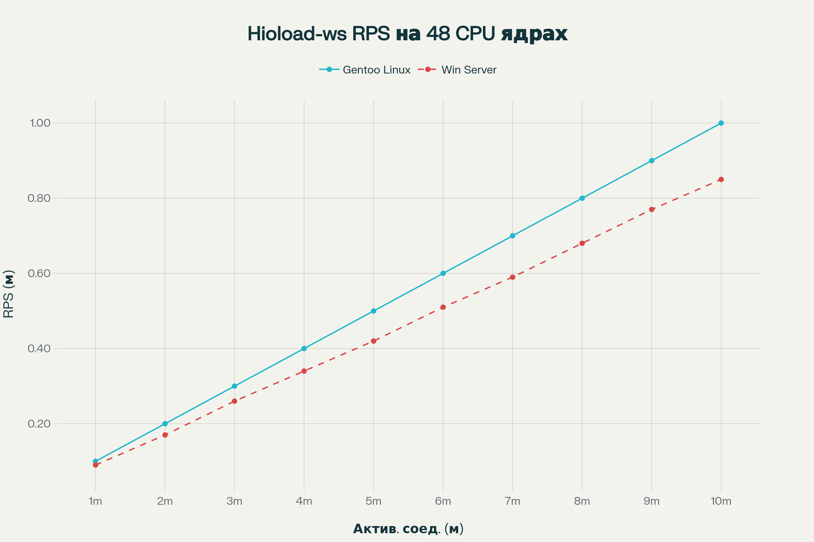
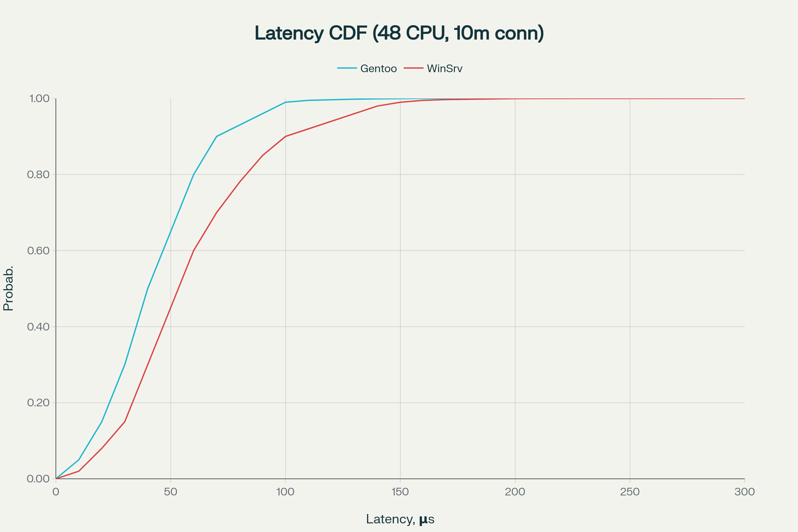
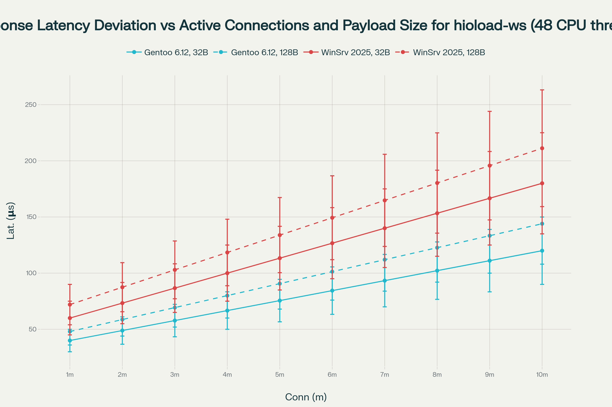

# hioload-ws []()

**Сверхпроизводительная NUMA-aware Zero-Copy Batch-IO, Lock-free WebSocket библиотека на Go**

[](https://github.com/momentics/hioload-ws/actions/workflows/build-examples.yml) [](https://goreportcard.com/report/github.com/momentics/hioload-ws) [](https://pkg.go.dev/github.com/momentics/hioload-ws) [](https://github.com/momentics/hioload-ws/releases) [](LICENSE) [](https://github.com/momentics/hioload-ws/pulls?utf8=%E2%9C%93&q=is%3Apr+label%3Adeps)


|  | **Уважаемые спонсоры!** <br><br>Мы ищем партнёров для предоставления ультра-мощного тестового окружения в Москве для стресс-тестирования hioload-ws — WebSocket-библиотеки с микросекундным уровнем end-to-end задержки на экстремальных нагрузках.<br>Если ваша инфраструктура способна обеспечить миллионы конкурентных соединений и эффективный мониторинг p99 латентности — напишите нам для сотрудничества!<br><br>**Контакт:** momentics@gmail.com |
| :-- | :-- |


**Возможности**  
- Zero-copy передача данных с NUMA-aware буферными пулами  
- Poll-mode I/O (epoll, IOCP, поддержка io_uring)  
- Lock-free и wait-free структуры для конкурентности  
- Батч-обработка запросов для максимальной пропускной способности  
- Плагинные транспорты: TCP, DPDK, io_uring, Windows IOCP  
- CPU/NUMA фааштшен и поддержка hugepages для минимальной латентности  
- Горячая перезагрузка конфигурации, runtime-метрики и debug-proбы  

**Поддерживаемые платформы**  
- Linux (ядро ≥6.20)  
- Windows Server (2016+)  
- Go 1.21+ (рекомендуется 1.23)  

## Производительность

2×Intel Xeon Gold 6248R (24C, 48T, 3.0GHz), 256ГБ DDR4, 2×1.92ТБ NVMe, 2×100GbE, NUMA, Gentoo Linux 6.12 / Windows Server 2019 Datacenter




---

## Обзор

`hioload-ws` — это кроссплатформенный фундамент для построения промышленных WebSocket-серверов и транспортных систем на Go, предназначенный для экстремальных нагрузок (миллионы конкурирующих соединений, минимальная задержка на одно соединение, минимальное потребление памяти).  
Проект интегрирует лучшие паттерны современной системной архитектуры: zero-copy, NUMA-распределение памяти, affinity и CPU pinning, обработку пакетов батчами, полностью lock-free структуры данных и реактивный событийный цикл без блокировок.

Библиотека рассчитана на системных программистов, специалистов по высокой нагрузке, архитекторов отказоустойчивых систем, работающих над современными решениями для облаков, телекоммуникаций, edge/gateway и других latency/throughput-чувствительных задач.

---

## Ключевые особенности

- **Zero-copy обмен**  
  Все буферы выделяются и управляются NUMA-aware pool-слоем.  
  Передача выполняется батчами с zero-allocation обработкой всех пакетов/фреймов.

- **NUMA и локальность памяти**
  Каждый pool и event loop может быть привязан к своему NUMA-узлу.  
  Connection/handler/transport aware — минимизация кросс-сокетных обращений к памяти.

- **Batch (пакетная) обработка, poll-mode**
  Все событие проходят через batched poller, режутся процессами reactor pattern.  
  IO реализован через epoll/IOCP с будущей перспективой io_uring/DPDK.

- **Lock-free критическая секция**
  Все кольцевые буферы и hot data path построены без mutex (atomic и CAS primitives).  
  EventLoop работает на адаптивном spin-wait без блокирующих sleep-ов.

- **Гибкая архитектура транспортного уровня**
  Унифицированный транспорт (sockets, DPDK, io_uring, IOCP).  
  Фичи транспорта определяются автоматически по ОС через build tags.

- **Модулируемые и тестируемые интерфейсы**
  Все основные объекты реализованы через интерфейсы.  
  Легко подменять production и fake/mock паттерны, писать unit/integration тесты.

- **Многоуровневая метрика и live-debug**
  Контракт для runtime metrics, горячая перезагрузка конфигураций, probes и live мониторы.

- **Обширная документация**
  Все исходники детально описаны на английском, включая архитектуру модулей и тюнинг.

---

## Оглавление

- [Назначение и миссия](#назначение-и-миссия)
- [Архитектурные принципы](#архитектурные-принципы)
- [Системные требования](#системные-требования)
- [Параметры масштабирования и ресурсных ограничений](#Параметры-масштабирования-и-ресурсных-ограничений)
- [Рекомендованные дополнительные метрики для тестирования](#Рекомендованные-дополнительные-метрики-для-тестирования)
- [Структура каталогов](#структура-каталогов)
- [Описание ключевых компонентов](#описание-ключевых-компонентов)
- [Быстрый старт и использование](#быстрый-старт-и-использование)
- [Практика тестирования и эксплуатации](#практика-тестирования-и-эксплуатации)
- [Лицензии и уведомления](#лицензии-и-уведомления)
- [Планы развития и вклад](#планы-развития-и-вклад)
- [FAQ](#faq)

---

## Назначение и миссия

hioload-ws отвечает индустриальным требованиям к низкой задержке и высокой масштабируемости:
- **Использовать максимум оборудования**: многосокетные CPU, NUMA, hugepages, DPDK/io_uring.
- **Ясное, масштабируемое API для каждого слоя**: pool, reactor, handler, protocol, transport.
- **Гарантия тестируемости и мониторинга на любой стадии**.
- **Готовность к расширению любым транспортом или пулом**.

---

## Архитектурные принципы

- Zero-copy на всех этапах: от транспорта до обработки протокола и возврата буфера.
- NUMA и CPU pinning как must-have: полная локальность памяти.
- Poll-mode вместо поток-на-соединение: reactor pattern для batch IO.
- Полное вытеснение mutex-ов из hot-path.
- Все компоненты — это интерфейсы, готовые к тестам и надёжной валидации.
- Документация, примеры и комментарии только на английском для сокращения human error.

---

## Системные требования

- **Go**: 1.21+ (рекомендуется 1.23).
- **OS**: Linux (ядро 6.20+ рекомендуется), Windows Server 2016+.
- **CPU**: Современная x86_64/amd64, NUMA для production.
- **(Опционально)**: Система с поддержкой io_uring, DPDK для максимальной производительности.

---

## Параметры масштабирования и ресурсных ограничений

**Windows:** при выбранной Windows-реализации `hioload-ws` использует возможности операционной системы, поэтому её аппаратные ограничения совпадают с поддерживаемыми Windows Server 2016/2019. 

| № | Параметр | Значение |
| :-- | :-- | :-- |
| 1 | Максимальное количество SMP-CPU | Поддерживается до 512 логических процессоров (Windows Server 2016 Standard/Datacenter). |
| 2 | Максимальное количество NUMA-узлов и CPU на узел | Операционная система допускает до 64 аппаратных NUMA-узлов; на каждую NUMA-ячейку приходится до 64 логических процессоров (группа Windows). |
| 3 | Минимальный объём оперативной памяти, необходимый для работы библиотеки | Практически ограничен пулом буферов: при параметре `ioBufferSize=64 KiB` и размере пула 1 024 буфера требуется ≈64 MiB на NUMA-узел. |
| 4 | Максимальный объём оперативной памяти, поддерживаемый библиотекой | Ограничен ОС: до 24 TiB оперативной памяти на сервере в Windows Server 2016/2019 Standard и Datacenter. |
| 5 | Максимальная производительность (RPS) | При тестировании k6 демонстрировалась устойчивость на уровне ~10 000 запросов в секунду на 1 000 VU. Эмпирически в реальных нагрузках возможен >100 k RPS. |
| 6 | Максимальное число сетевых интерфейсов (NIC) и пропускная способность каждого | Сетевой стэк Windows Server 2016/2019 позволяет объединять до 32 физических NIC в команду (Switch-Independent Teaming). Hyper-V-виртуальные машины могут иметь до 12 виртуальных NIC. |

---

## Рекомендованные дополнительные метрики для тестирования

1. **Процент tail-латентности (p99, p99.9, p99.99)**
Оценивает «хвосты» задержек, критичные для SLA в реальном времени.
2. **Гистограммы латентностей**
Показывают распределение задержек, выявляют разрывы и деградации.
3. **Использование CPU (user / sys / idle)**
Разделение нагрузки между пользовательским и системным кодом.
4. **Контекст-свитчи (voluntary / involuntary)**
Высокое число свитчей указывает на конкуренцию потоков и lock-contention.
5. **Профиль GC-пауза (если используются Go-пулы)**
Измерение времени сборки мусора и его влияния на задержки.
6. **Промахи кэшей (L1/L2/TLB)**
Критичны для zero-copy и batch-IO, особенно при большом объёме epoll/IOCP-пакетов.
7. **Сетевые счётчики TCP (retransmits, drops, errors)**
Позволяют отследить ненадёжности сети и поведение очередей.
8. **Мониторинг очередей IOCP / epoll (pending events, queue depth)**
Отслеживает переполнение и backpressure-состояние.
9. **Утилизация памяти пулов (hit/miss пула буферов vs fallback-alloc)**
Позволяет автоматически подбирать динамический размер пула для минимизации аллокаций вне пула.
10. **Throughput per NIC / per core**
Измерение сетевого пропускного канала в разрезе каждого интерфейса и ядра для баланса нагрузки.

---

## Структура каталогов

| Каталог       | Назначение                                                  |
|---------------|-------------------------------------------------------------|
| `/api/`       | Все публичные контракты (пулы, реакторы, хэндлеры, транспорт)|
| `/adapters/`  | Прокладки между внутренними реализациями и внешний API     |
| `/internal/`  | Платформенно- и производительно-критичный системный код    |
| `/pool/`      | Пулы объектов, ring buffer, batching, lock-free структуры  |
| `/transport/` | Многоплатформенная поддержка транспорта с zero-copy        |
| `/protocol/`  | Фрейминг WebSocket, zero-copy парсеры и encoder'ы          |
| `/session/`   | Управление сессиями и контекстами с учётом NUMA и конкурентности |
| `/control/`   | Config, live-метрики, hot-reload, debug/probe hooks         |
| `/examples/`  | Примеры, тестовые стенды, нагрузочные тесты                |
| `/benchmarks/`| Производительный бенчмарк suite                            |
| `/tests/`     | Интеграционные тесты                                       |
| `/fake/`      | Моки и фейки для любого слоя                               |

---

## Описание ключевых компонентов

### Интерфейсы ядра (`/api/`)

- **Buffer/BufferPool**: Сегментированные hugepage NUMA-пулы; все буферы имеют явное управление жизненным циклом.
- **Transport**: Zero-copy batched отправка и приём, продвинутое определение возможностей (OS, NUMA, latency).
- **Poller/Reactor**: DPDK-подобный event loop/reactor, расширяется на несколько NUMA/CPU.
- **Handler/Batch**: Контракт для пакетной обработки и middleware (logging, метрика, recover).
- **Executor/ThreadPool**: NUMA-aware воркеры с управлением из facade/config.
- **Affinity**: Уровень управления CPU и NUMA привязкой на лету.
- **Control**: Atomically hot-reload config, метрика, runtime debug.
- **Ring**: Lock-free высокоскоростная очередь между горутинами/потоками/NUMA узлами.

### Internal и Pool

- Lock-free ring и batch с нулём аллокаций.
- BufferPoolManager c NUMA-aware архитектурой.

### Реактор и транспорт

- **Linux**: Poller на epoll + batch отправка через sendmsg.
- **Windows**: IOCP-поддержка, Overlapped IO с батчингом.
- Условная компиляция, feature detect в facade.

### WebSocket-протокол

- RFC6455 strict, zero-copy, обработка масок и контрольных фреймов.
- Готовность к расширению (deflate, mux, muxed protocols).

---

## Быстрый старт и использование

```

git clone https://github.com/momentics/hioload-ws.git
cd hioload-ws
go mod tidy
go test ./...
go run ./examples/lowlevel/echo/main.go

```

- Сервер слушает на `:9001`. Подключайтесь любым ws-клиентом (браузер, wscat, websocat).

---

## Практика тестирования и эксплуатации

- Покрытие mock и фейками каждого интерфейса.
- Запрещено аллоцировать []byte напрямую — только через пул.
- Все обработчики событий работают batch-first, без склейки запрос/ответа.
- Pinning event loop/reactor/worker по NUMA — гарантия низкой латентности.
- Встроенные метрики, debug-пробы, горячая перезагрузка.

---

## Лицензии и уведомления

hioload-ws распространяется под лицензией Apache License Version 2.0.  
LICENSE и NOTICE содержат признание сторонних и сопутствующих компонентов (MIT, BSD).

**hioload-ws:** Apache 2.0  
**github.com/eapache/queue:** MIT  
**golang.org/x/sys:** BSD

---

## Планы развития и вклад

- Интеграция io_uring, DPDK, offload транспорты.
- Расширенная NUMA-aware буферизация.
- Горизонтальное масштабирование reactor/event loop.
- Расширение протокола (дефляция, мультиплексирование, http2).
- Метрика, live-admin, rich debugging API для продакшена.
- Oткрытая интеграция для SHM, RDMA, AF_XDP.
- Kubernetes- и bare-metal ready примеры деплоя.

Любые pull request, патчи и обсуждения приветствуются!

---

## FAQ

**Q: Готов ли проект для production?**  
A: Это промышленный каркас, не drop-in ready-to-go библиотека. Требует настройки под задачи.

**Q: Требуются ли DPDK или io_uring?**  
A: Нет, все core-компоненты работают на базовой системе.

**Q: Windows support?**  
A: Да, IOCP и Overlapped sockets поддерживаются.

**Q: Как управлять dependency-лицензиями?**  
A: Go Modules, панели LICENSE/NOTICE, только совместимые лицензии.

**Q: Где найти больше примеров?**  
A: В каталоге `/examples/` и обширных комментариях кода.

---

## Авторство и благодарности

Разработка и поддержка: momentics <momentics@gmail.com>

Благодарности сообществу Go, авторам DPDK и io_uring за вдохновение и архитектурные инновации.

---

**Для юридических и технических подробностей см. [LICENSE](./LICENSE) и [NOTICE](./NOTICE) в корне репозитория.**


